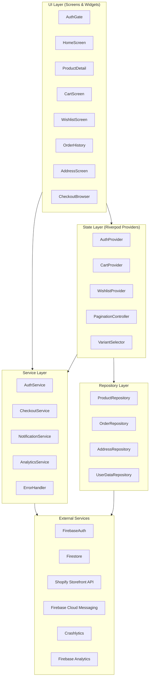
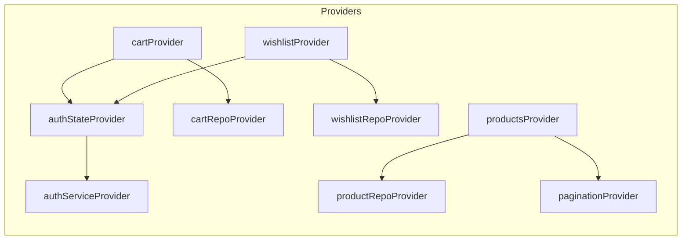

# Design Document: App Completion

## Overview

This design transforms the Niyati Mart Flutter fashion store from a demo-quality frontend into a production-ready shopping application. The current codebase has a product grid, login screen, product detail, and local cart/wishlist managed with `setState`. This design introduces a layered architecture with Riverpod for reactive state management, Firebase services for persistence and authentication, Shopify Storefront API for live product data, and structured error handling, analytics, and testing.

The migration is incremental — existing screens are refactored to consume Riverpod providers rather than being rewritten. New capabilities (checkout, order history, addresses, push notifications, pagination) are added as new provider/repository pairs that slot into the established layer boundaries.

## Architecture

### High-Level Architecture



### Layer Responsibilities

| Layer | Responsibility | Flutter Imports Allowed |
|-------|---------------|----------------------|
| UI | Render widgets, handle gestures, observe providers | Yes |
| State | Business logic, state mutations, coordination | No (except `ChangeNotifier` from `foundation`) |
| Service | Cross-cutting concerns (analytics, errors, notifications) | No |
| Repository | Data access, API communication, serialization | No |

### State Management Architecture (Riverpod)



Riverpod is chosen over Provider because:
1. Compile-time safety — providers are global objects, not runtime lookups
2. No `BuildContext` required in business logic
3. Built-in support for `AsyncValue` simplifying loading/error/data states
4. `autoDispose` prevents memory leaks for screen-scoped state
5. Provider overrides enable clean testing without mocks in the widget tree

## Components and Interfaces

### 1. Auth Gate & Auth Service

```dart
// providers/auth_providers.dart
final authServiceProvider = Provider<AuthRepository>((ref) => AuthRepository());

final authStateProvider = StreamProvider<User?>((ref) {
  return ref.watch(authServiceProvider).authStateChanges;
});
```

**AuthGate widget** listens to `authStateProvider`:
- `AsyncLoading` → loading indicator (max 10s timeout)
- `AsyncData(null)` → `LoginScreen`
- `AsyncData(user)` → `HomeScreen`
- Timeout after 10s → treat as unauthenticated

Guest users can browse products, view product details, and use the cart without authentication.

### 2. Cart Provider

```dart
// providers/cart_provider.dart
class CartNotifier extends StateNotifier<CartState> {
  CartNotifier(this._firestore, this._userId) : super(CartState.empty());

  Future<void> addItem(String productId, String variantId, double price);
  Future<void> incrementQuantity(String itemKey);
  Future<void> decrementQuantity(String itemKey);
  Future<void> removeItem(String itemKey);
  Future<void> loadFromFirestore();
  Future<void> mergeLocalWithRemote();

  double get subtotal;
  int get distinctItemCount;
}
```

**Cart item key**: `"${productId}_${variantId}"` — ensures same product with different variants are tracked separately.

**Sync strategy**:
- Authenticated: write-through to `users/{uid}/cart/{itemKey}` within 3s
- Guest: in-memory only
- On login: merge local + remote, keep higher quantity for duplicates
- On sync failure: retain local state, show non-blocking error, retry on next mutation

### 3. Wishlist Provider

```dart
// providers/wishlist_provider.dart
class WishlistNotifier extends StateNotifier<WishlistState> {
  Future<void> addItem(String productId);
  Future<void> removeItem(String productId);
  Future<void> loadFromFirestore();
  Future<void> mergeLocalItems();
}
```

**Sync strategy**: Same pattern as cart — write-through for authenticated users, merge on first login, local-only for guests.

### 4. Shopify Client & Product Repository

```dart
// repositories/shopify_product_repository.dart
class ShopifyProductRepository implements ProductRepository {
  ShopifyProductRepository({required this.shopifyClient});

  final ShopifyClient shopifyClient;

  @override
  Future<PaginatedResult<Product>> fetchProducts({String? cursor, int first = 20});

  @override
  Future<List<Product>> fetchProductsByCategory(String category);

  @override
  Future<Product> fetchProductById(String id);
}
```

```dart
// services/shopify_client.dart
class ShopifyClient {
  static const _apiVersion = '2026-01';

  ShopifyClient({
    required this.storeDomain,
    required this.storefrontAccessToken,
    http.Client? httpClient,
  });

  Future<Map<String, dynamic>> query(String graphqlQuery, {Map<String, dynamic>? variables});
}
```

The Storefront Access Token is provided via `--dart-define=SHOPIFY_TOKEN=xxx` at compile time. Build fails if not set.

### 5. Variant Selector

```dart
// widgets/variant_selector.dart
class VariantSelector extends ConsumerWidget {
  // Groups options by option name (Size, Color)
  // Tracks selected option per group
  // Resolves current variant from combination of selections
  // Updates displayed price and availability
  // Disables Add to Cart if variant is sold out
}
```

### 6. Checkout Service

```dart
// services/checkout_service.dart
class CheckoutService {
  Future<String> createShopifyCart(List<CartItem> items);
  Future<void> openCheckoutUrl(String url);
  Future<CheckoutResult> handleCheckoutResult(Uri redirectUri);
}
```

Flow: Cart items → Shopify Cart Mutation → Get checkout URL → Open in-app browser → Detect completion via redirect URL → Clear cart + show confirmation.

### 7. Order Repository

```dart
// repositories/order_repository.dart
class OrderRepository {
  Future<PaginatedResult<Order>> fetchOrders({String? cursor, int first = 20});
  Future<OrderDetail> fetchOrderDetail(String orderId);
}
```

### 8. Address Repository

```dart
// repositories/address_repository.dart
class AddressRepository {
  Future<List<Address>> fetchAddresses(String userId);
  Future<void> saveAddress(String userId, Address address);
  Future<void> deleteAddress(String userId, String addressId);
  Future<void> setDefaultAddress(String userId, String addressId);
  ValidationResult validateAddress(Address address);
}
```

Validation rules: All required fields non-empty after trim. Max lengths enforced (name: 100, phone: 20, line1: 200, city: 100, state: 100, postalCode: 20, country: 100). Maximum 10 addresses per user.

### 9. Notification Service

```dart
// services/notification_service.dart
class NotificationService {
  Future<bool> requestPermission();
  Future<void> registerToken();
  Future<void> subscribeToTopics(List<String> topics);
  Future<void> unsubscribeFromTopics(List<String> topics);
  Future<void> removeTokenFromProfile(String userId);
  void handleForegroundMessage(RemoteMessage message);
  void handleNotificationTap(RemoteMessage message);
}
```

### 10. Analytics Service

```dart
// services/analytics_service.dart
class AnalyticsService {
  void logProductViewed(String productId, String category);
  void logAddToCart(String productId, String variantId, double price);
  void logCheckoutStarted(double total, int itemCount);
  void logPurchaseCompleted(double total, int itemCount);
  void logSearch(String query);
  void setUserId(String? uid);
  void reportCrash(dynamic error, StackTrace stackTrace, {bool fatal = false});
}
```

All event logging is fire-and-forget — failures are silently discarded. PII is never logged (no email, phone, or name in events).

### 11. Pagination Controller

```dart
// providers/pagination_provider.dart
class PaginationNotifier extends StateNotifier<PaginationState<Product>> {
  Future<void> loadNextPage();
  void reset();

  bool get hasMore;
  bool get isLoading;
}
```

Fetches 20 items per page. Triggers next fetch when user scrolls within 3 items of bottom. Retains loaded products and scroll position across navigation.

### 12. Error Handler

```dart
// services/error_handler.dart
class ErrorHandler {
  AppError classify(dynamic error);
  String userMessage(AppError error);
  Future<void> report(dynamic error, StackTrace stackTrace);
}

enum AppErrorType {
  noConnection,
  timeout,
  apiValidation,
  notFound,
  unknown,
}
```

Network timeout: 15 seconds. User-facing messages never expose stack traces or internal codes.

## Data Models

### CartItem

```dart
class CartItem {
  final String productId;
  final String variantId;
  final String productName;
  final String productImage;
  final double price;
  final String currencyCode;
  final int quantity; // 1..99

  String get itemKey => '${productId}_$variantId';
  double get lineTotal => price * quantity;

  Map<String, dynamic> toMap();
  factory CartItem.fromMap(Map<String, dynamic> map);
}
```

### CartState

```dart
class CartState {
  final Map<String, CartItem> items; // keyed by itemKey
  final bool isSyncing;
  final String? syncError;

  double get subtotal => items.values.fold(0, (sum, item) => sum + item.lineTotal);
  int get distinctItemCount => items.length;
}
```

### WishlistState

```dart
class WishlistState {
  final Map<String, WishlistItem> items; // keyed by productId
  final bool isSyncing;
  final String? syncError;

  int get itemCount => items.length;
}
```

### PaginatedResult

```dart
class PaginatedResult<T> {
  final List<T> items;
  final String? nextCursor;
  final bool hasNextPage;
}
```

### PaginationState

```dart
class PaginationState<T> {
  final List<T> items;
  final String? nextCursor;
  final bool hasNextPage;
  final bool isLoading;
  final String? error;
}
```

### Order & OrderDetail

```dart
class Order {
  final String id;
  final String orderNumber;
  final DateTime createdAt;
  final double totalAmount;
  final String currencyCode;
  final String fulfillmentStatus;

  Map<String, dynamic> toMap();
  factory Order.fromShopifyJson(Map<String, dynamic> json);
}

class OrderDetail extends Order {
  final List<OrderLineItem> lineItems;
  final Address? shippingAddress;
  final String? trackingUrl;
}

class OrderLineItem {
  final String title;
  final String variantTitle;
  final int quantity;
  final double price;
  final String? imageUrl;
}
```

### AppError

```dart
class AppError {
  final AppErrorType type;
  final String? apiMessage;
  final dynamic originalError;
  final StackTrace? stackTrace;
}
```

### Firestore Document Structure

```
users/{uid}
├── name, email, phone, createdAt, defaultAddressId, fcmToken
├── cart/{itemKey}
│   └── productId, variantId, productName, productImage, price, currencyCode, quantity
├── wishlist/{productId}
│   └── productId, variantId, addedAt
└── addresses/{addressId}
    └── name, phone, line1, line2, city, state, postalCode, country, isDefault
```


## Correctness Properties

*A property is a characteristic or behavior that should hold true across all valid executions of a system — essentially, a formal statement about what the system should do. Properties serve as the bridge between human-readable specifications and machine-verifiable correctness guarantees.*

### Property 1: Model Serialization Round-Trip

*For any* valid instance of Product, Address, UserProfile, WishlistItem, AppSettings, or CartItem, serializing to a map via `toMap()` and then deserializing from that map via `fromMap()` SHALL produce an object with field values identical to the original.

**Validates: Requirements 14.1, 14.7, 14.8**

### Property 2: Cart Mutation Invariants

*For any* product ID and variant ID, adding the item to an empty cart SHALL result in a cart entry with quantity 1; adding the same product ID and variant ID to a cart that already contains that combination SHALL increment the existing quantity by 1; and for any cart item with quantity Q, the quantity after increment SHALL be min(Q+1, 99) and the quantity after decrement SHALL be max(Q-1, 0), with the item removed entirely when the result is 0.

**Validates: Requirements 3.1, 3.2, 3.3, 3.4**

### Property 3: Cart Subtotal Calculation

*For any* set of cart items with prices and quantities, the cart subtotal SHALL equal the sum of each item's price multiplied by its quantity (Σ price_i × quantity_i).

**Validates: Requirements 3.10**

### Property 4: Cart Merge Keeps Higher Quantity

*For any* local cart state and remote cart state, merging them SHALL produce a cart that contains all items from both sources, and for items that exist in both, the merged quantity SHALL equal the maximum of the two quantities.

**Validates: Requirements 3.7**

### Property 5: Wishlist Merge is Set Union Without Duplicates

*For any* local wishlist and remote wishlist, merging them SHALL produce a wishlist that contains every product ID from both sources exactly once, with no duplicate entries based on product ID.

**Validates: Requirements 4.6**

### Property 6: Address Validation

*For any* address where any required field (name, phone, line1, city, state, postalCode, country) is empty after trimming whitespace OR exceeds its maximum character length (name: 100, phone: 20, line1: 200, city: 100, state: 100, postalCode: 20, country: 100), validation SHALL reject the address and identify the invalid fields. For any address where all required fields are non-empty after trim and within length limits, validation SHALL accept the address.

**Validates: Requirements 9.2, 9.3**

### Property 7: Default Address Uniqueness

*For any* list of addresses belonging to a user, after setting one address as default, exactly one address in the list SHALL have `isDefault = true` and its ID SHALL match the selected address ID, while all other addresses SHALL have `isDefault = false`.

**Validates: Requirements 9.4**

### Property 8: Variant Resolution From Selected Options

*For any* product with variants and any combination of selected options (one per option group), the resolved variant SHALL be the variant whose `selectedOptions` map matches all the currently selected option values. If no variant matches the full combination, the resolution SHALL return null (indicating sold out / unavailable).

**Validates: Requirements 5.3, 5.4**

### Property 9: Pre-Select First Available Variant

*For any* non-empty list of product variants, the pre-selected variant SHALL be the first variant in list order where `availableForSale` is true. If no variant is available for sale, the pre-selected variant SHALL be the first variant in the list.

**Validates: Requirements 5.2**

### Property 10: Error Classification and User Message Safety

*For any* error produced by network requests or API calls, the Error_Handler SHALL classify it into one of the defined error types (noConnection, timeout, apiValidation, notFound, unknown), and the resulting user-facing message SHALL NOT contain stack traces, internal error codes, class names, or technical implementation details. Additionally, for API validation errors, the displayed message SHALL be truncated to a maximum of 200 characters.

**Validates: Requirements 12.1, 12.2, 12.3, 12.5**

### Property 11: Analytics Search Query Truncation

*For any* search query string, the Analytics_Service SHALL log the query truncated to a maximum of 256 characters, preserving the first 256 characters verbatim.

**Validates: Requirements 13.5**

## Error Handling

### Error Classification Strategy

All errors flow through the centralized `ErrorHandler` which classifies them into user-appropriate categories:

| Error Source | Classification | User Message | Action |
|-------------|---------------|-------------|--------|
| `SocketException` / no connectivity | `noConnection` | "No internet connection" | Retry button |
| HTTP timeout (>15s) | `timeout` | "Request timed out" | Retry button |
| Shopify GraphQL error response | `apiValidation` | API message (≤200 chars) | Retry button |
| HTTP 404 / empty product response | `notFound` | "Product not available" | Back navigation |
| All other errors | `unknown` | "Something went wrong. Please try again." | Retry button |

### Error Display Patterns

1. **Inline error**: Non-blocking snackbar for sync failures (cart/wishlist Firestore writes)
2. **Full-screen error**: When primary screen content fails to load — shows icon + message + retry button replacing content
3. **Loading → Error transition**: All retry buttons show a loading indicator while the retry is in progress

### Error Reporting

- All `unknown` errors are reported to Firebase Crashlytics with stack trace, anonymous user ID, and auth state
- Known/expected errors (no connection, timeout) are NOT reported to Crashlytics
- Error reporting never blocks the UI or throws secondary exceptions

### Retry Strategy

- User-initiated retry: re-executes the exact failed operation
- Firestore sync retry: automatic on next state mutation (cart/wishlist)
- FCM token registration: 3 retries with exponential backoff (2s, 4s, 8s)
- No automatic retry for product/order fetches — user must tap retry

## Testing Strategy

### Testing Framework & Tools

- **Unit tests**: `flutter_test` (built-in)
- **Property-based tests**: `glados` package (Dart property-based testing library)
- **Widget tests**: `flutter_test` with `WidgetTester`
- **Integration tests**: `integration_test` package
- **Mocking**: `mocktail` for clean mock creation without code generation

### Property-Based Tests (via `glados`)

Each correctness property maps to a single property-based test with minimum 100 iterations:

| Property | Test File | Generator Strategy |
|----------|-----------|-------------------|
| 1: Model Round-Trip | `test/properties/model_serialization_test.dart` | Random strings, doubles, booleans, DateTimes for each model field |
| 2: Cart Mutations | `test/properties/cart_mutations_test.dart` | Random product/variant IDs, random initial quantities [1-99] |
| 3: Cart Subtotal | `test/properties/cart_subtotal_test.dart` | Random lists of (price, quantity) pairs |
| 4: Cart Merge | `test/properties/cart_merge_test.dart` | Two random cart maps with overlapping keys |
| 5: Wishlist Merge | `test/properties/wishlist_merge_test.dart` | Two random sets of product IDs with overlap |
| 6: Address Validation | `test/properties/address_validation_test.dart` | Random strings including empty, whitespace, over-length |
| 7: Default Address | `test/properties/address_default_test.dart` | Random address lists with random default selection |
| 8: Variant Resolution | `test/properties/variant_resolution_test.dart` | Random variant lists with option maps, random selections |
| 9: First Available Variant | `test/properties/variant_preselect_test.dart` | Random variant lists with mixed availability |
| 10: Error Classification | `test/properties/error_classification_test.dart` | Random error types with random message strings |
| 11: Search Truncation | `test/properties/search_truncation_test.dart` | Random strings of length 0-1000 |

Each test is tagged: `// Feature: app-completion, Property {N}: {title}`

Configuration: minimum 100 iterations per property via `Glados` explore count.

### Unit Tests (Example-Based)

| Component | Test Focus |
|-----------|-----------|
| `CartNotifier` | Add item, increment, decrement to 0 removes, subtotal |
| `WishlistNotifier` | Add, remove, merge local into remote |
| `CheckoutService` | Cart creation, empty cart rejection, error propagation |
| `NotificationService` | Permission handling, retry logic, logout cleanup |
| `AnalyticsService` | Event logging, PII exclusion, silent failure |
| `ErrorHandler` | Each error type → correct message mapping |
| `AddressRepository` | Save, delete, max 10 limit, default management |

### Widget Tests

| Screen | Test Focus |
|--------|-----------|
| `AuthGate` | Shows login when unauthenticated, home when authenticated, timeout handling |
| `ProductDetailScreen` | Variant selection updates price, sold-out disables button |
| `CartScreen` | Increment/decrement buttons, remove item, checkout button states |
| `VariantSelector` | Option grouping, selection highlighting, image updates |
| `OrderHistoryScreen` | Loading/empty/error states, guest prompt |
| `AddressListScreen` | Default badge display, add/delete interactions |

### Integration Tests

| Flow | Test Focus |
|------|-----------|
| Auth Flow | Google Sign-In → HomeScreen, Sign-Out → LoginScreen |
| Cart Sync | Add items offline → go online → verify Firestore sync |
| Checkout | Full checkout flow with mock Shopify responses |

### Test Organization

```
test/
├── properties/           # Property-based tests (glados)
│   ├── model_serialization_test.dart
│   ├── cart_mutations_test.dart
│   ├── cart_subtotal_test.dart
│   ├── cart_merge_test.dart
│   ├── wishlist_merge_test.dart
│   ├── address_validation_test.dart
│   ├── address_default_test.dart
│   ├── variant_resolution_test.dart
│   ├── variant_preselect_test.dart
│   ├── error_classification_test.dart
│   └── search_truncation_test.dart
├── unit/                 # Example-based unit tests
│   ├── cart_notifier_test.dart
│   ├── wishlist_notifier_test.dart
│   ├── checkout_service_test.dart
│   ├── notification_service_test.dart
│   ├── analytics_service_test.dart
│   ├── error_handler_test.dart
│   └── address_repository_test.dart
├── widget/               # Widget tests
│   ├── auth_gate_test.dart
│   ├── product_detail_test.dart
│   ├── cart_screen_test.dart
│   ├── variant_selector_test.dart
│   ├── order_history_test.dart
│   └── address_list_test.dart
└── integration/          # Integration tests
    ├── auth_flow_test.dart
    ├── cart_sync_test.dart
    └── checkout_flow_test.dart
```

### Dependencies to Add

```yaml
# pubspec.yaml additions
dependencies:
  flutter_riverpod: ^2.5.1
  http: ^1.2.1
  url_launcher: ^6.2.5
  firebase_messaging: ^14.7.20
  firebase_analytics: ^10.8.10
  firebase_crashlytics: ^3.4.20

dev_dependencies:
  glados: ^1.1.1
  mocktail: ^1.0.3
  integration_test:
    sdk: flutter
```
